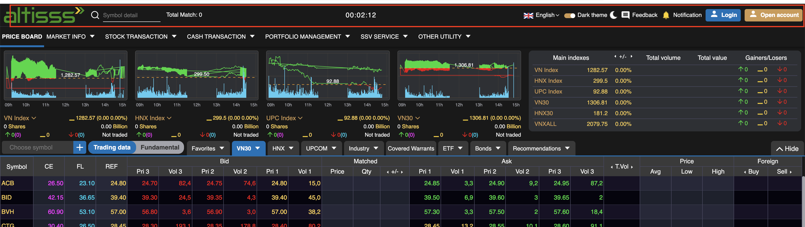
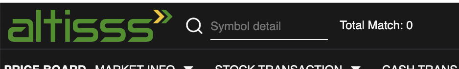
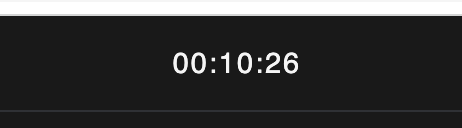
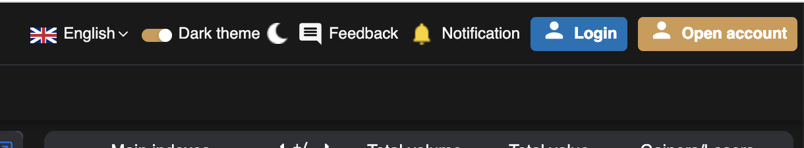

# Sumary
> Footer sumary 
>  

**Structure**
- Left 
	- Logo
	- Search box
	- Total value all exchange
- Center 
	- Exchange time
- Right
	- Change language
	- Change theme
	- Feedback
	- Notification
	- Login (When not login)
	- Open Account (When not login)
	- User Info (When Login)

# Content
**Images:**

## Left Header
**Images:** 

**Feature:** 
- Logo: Go to a link or open a company information popup 
- Search box: Search for a stock or warrant
- Total match: Total trading all exchange in real-time

**Code:**
- UI: 
- Logic: 

## Center Header
**Images:** 

**Feature:** 
- Display Time that Sync with server time. Method sync decribe in [background-service](../Background/Background%20Service/background-service.md)

**Code:**
- UI: 
- Logic: 

## Right Header
**Images:** 

**Feature:** 
- Change language
- Change theme
- Send Feedback 
- View Notification
- Open Account
- View User Info

**Code:**
- UI: 
- Logic: 