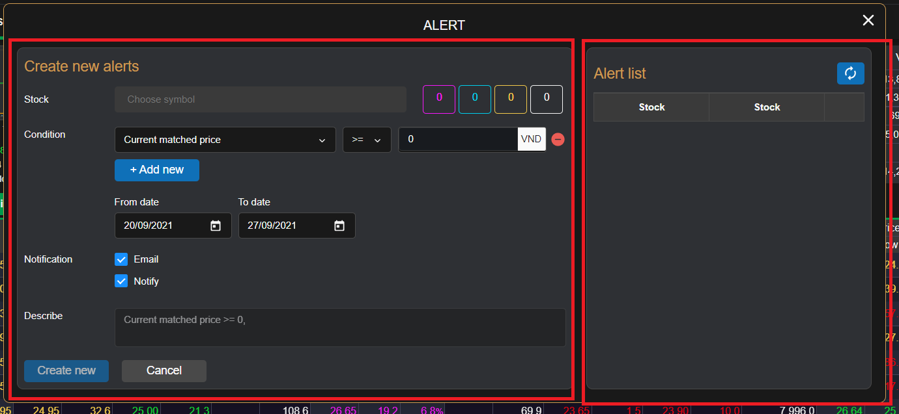
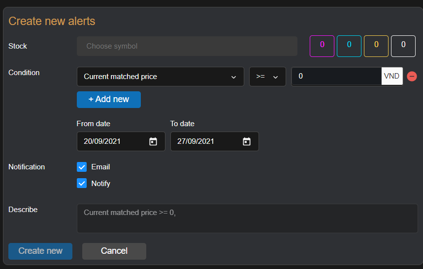
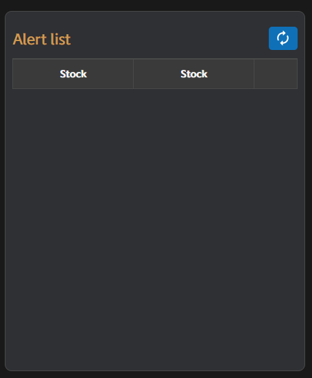

# Sumary
- Create Alert Form
- List Alert
>==[code](src\components\major\alert\index.js)==
> Pages includes: [Header](../../Common%20UI/Header.md), [Menu](../../Common%20UI/Menu.md), [Footer](../../Common%20UI/Footer.md) 

# Content
## Create Alert Form

**Images:**

**Feature:**
- Users can create new alerts
- User can update alerts

**Code:**
- UI: ==[code](src\components\major\alert\index.js)
- Logic:
## List Alert

**Images:**

**Feature:**
- Show list alerts of user
- User can pause an alert
- User can request update an alert
- User can delete an alert

**Code:**
- UI: ==[Manage list alert](src\components\major\alert\manage-list\index.js)
- Logic: