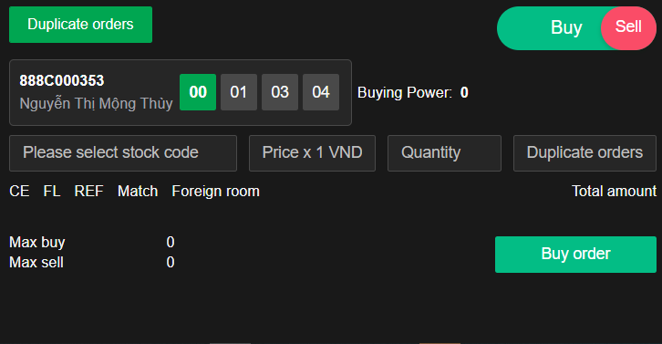

# Sumary
Duplicate order are exactly the same like [Order](../Normal%20Oder/normal-order.md), but system have one more function:
- AdvanceOrderMain:
# Content
**Images:**

**Feature:**
- Help user duplicate orders from one to how many orders user want
**code:**
- UI: ==[advance order](src\views\AdvanceOrder\main.js)
	- ==[Dupicate order](src\views\AdvanceOrder\main.js)
- Logic: handle duplicate order