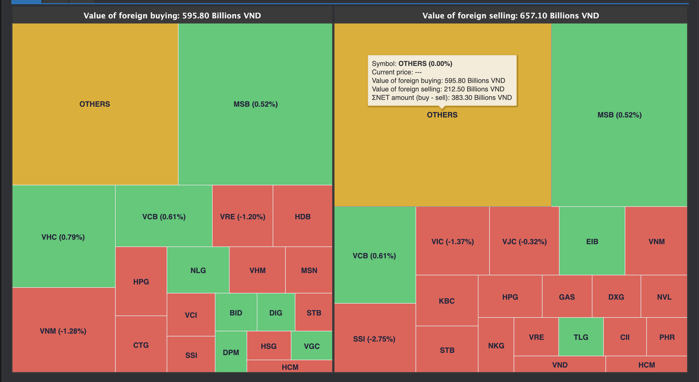

# Sumary
- Select Exchange
- Chart Foreigner trade
- Table Foreigner trade
	- Select time period
	- Selling
	- Buying

> Pages includes: [Header](../../Common%20UI/Header.md), [Menu](../../Common%20UI/Menu.md), [Footer](../../Common%20UI/Footer.md) 

# Content

## Select Exchange
**Images:** 

**Feature:** 
- Select a exchange to change data chart and table
- Save state to context store for use in whole app

**Code:** 
- UI: ==[link code](src\components\basic-component\select-exchange\index.js)==
- Logic: 

## Chart Foreginer trade
**Images:**

**Feature:** 
- The map shows the stocks getting attention from foreign investors, with a larger area showing a higher interest
- Users can view details by hovering the mouse pointer over the content to be viewed.

**Code:** 
- UI: 
- Logic: 
	- topFgrBuy and topFgrSell data was passed from parent component.
	- Handle and process data, save chart data to newData
	- Declare `options` variable, set structure data of chart to `options` variable
	- Render chart

## Table Foreigner trade

**Images: **

**Feature:** 
- User can view values in tabular form and can sort in ascending or descending order of values by column.

**Code:**
- UI:
- Logic:
	- Subscribe data
	- Listen realtime data and handle processing data
	- declare dataBuy and dataSell, set value to it
	- Call getForeignerData function to:
		- Declare an `InputParams` contain information of tableIsBuy.
		- send request to server contain `GetForeignerData`, `InputParams` and `handleGetHisForeignerTradeData` to store and handle processing data
	- Render table
