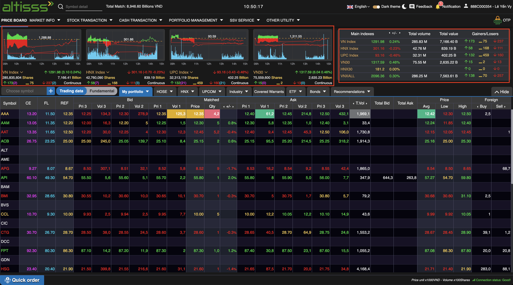
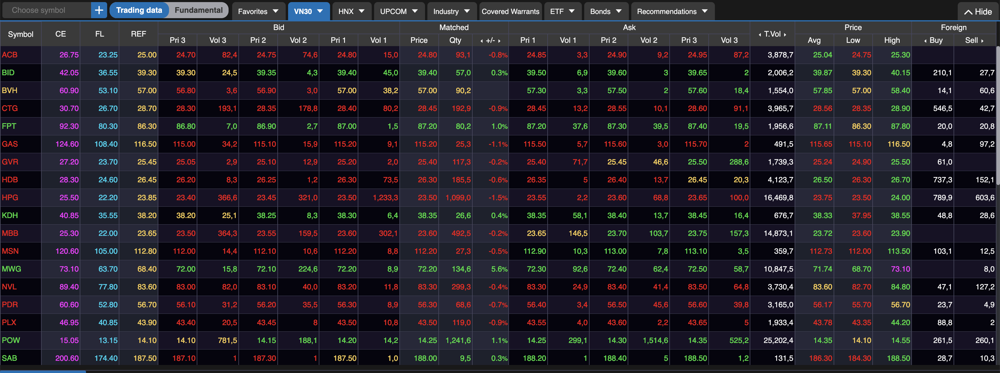

# Sumary
> Priceboard has chart index, market overview and table price realtime 
>  

**Structure**
- Header
- Menu
- Index Overview
	- Chart Index
	- Table Index overview
- Main Priceboard
- Footer 
	- Quick Order
	- Network status
	- Config System 

# Contents 
## [Header](../../Common%20UI/Header.md)
## [Menu](../../Common%20UI/Menu.md)
## Index Overview
**Images:** 

### Chart Index
**Feature:** 
- Users can view real-time index data
- Users can change metrics to view data according to personal preferences
- Users can view past price movements through the chart, the value is updated every one minute.

**Code:** 
- UI: 
- Logic: 
	- Stream: 
		- Topic: [MDDS|I, MDDS|SI, INTRADAY_1m]  
		- value: ['VNI', 'VN30', 'HNX30', ...]
	- Technology: HighCharts

### Table Index Overview
**Feature:** 
- Users can view index data real-time in tabular format.

**Code:** 
- UI: 
- Logic: 
	- Stream: 
		- Topic: [MDDS|I]  
		- value: ['VNI', 'VN30', 'HNX30', ...]

## Priceboard

**Images:**

**Features:** 
- There are 2 table views mode: trading data, fundamental data
- Lots of type table:
	- Normal trading data from common exchange
	- Put through
	- Odd lot
	- By Industry categories
	- Covered Warrent 
	- ETF
	- Bonds
	- Recommendation 
	- Favorite list 
- The price list is updated in real time

**Code:** 
- UI: ==[Code](src/views/PriceBoard/PriceBoardContainer/index.js)==
- Logic: 
	- Stream:
		- Topic:  MDDS|I ,  MDDS|TP,  MDDS|SI
		- Value: Stocks in view
	- Service: 
		- Get industry categories: FOSqMkt02_FinanceInfo
		- Get Recomendation list: FOSqNews_Suggest

## [Footer](../../Common%20UI/Footer.md)

