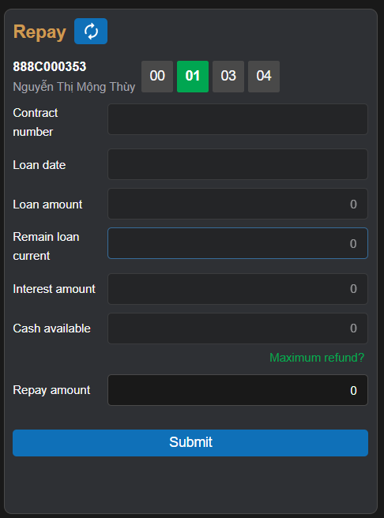

# Sumary
- Repay
- Current margin contract list
- Query margin history informations
> Pages includes: [Header](../../Common%20UI/Header.md), [Menu](../../Common%20UI/Menu.md), [Footer](../../Common%20UI/Footer.md) 
# Content
## Repay

**Images:**

**Feature:**
- User can choose sub-account to make margin repayment
- User can make margin repayment
**Code:**
- UI:
- Logic
## Current margin contract list
**Images:**

**Feature:**
-  Show current margin contract list
**Code:**
- UI:
- Logic
## Query margin history informations
**Images:**

**Feature:**
- Show Query margin history information
- User can export to Execl file
**Code:**
- UI:
- Logic
