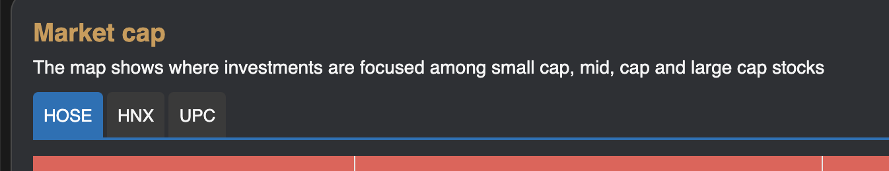
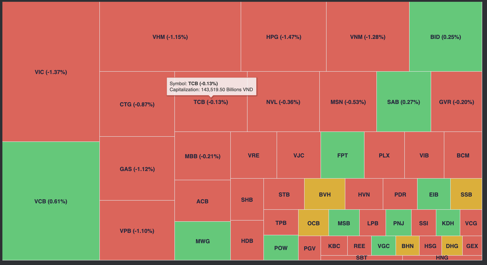
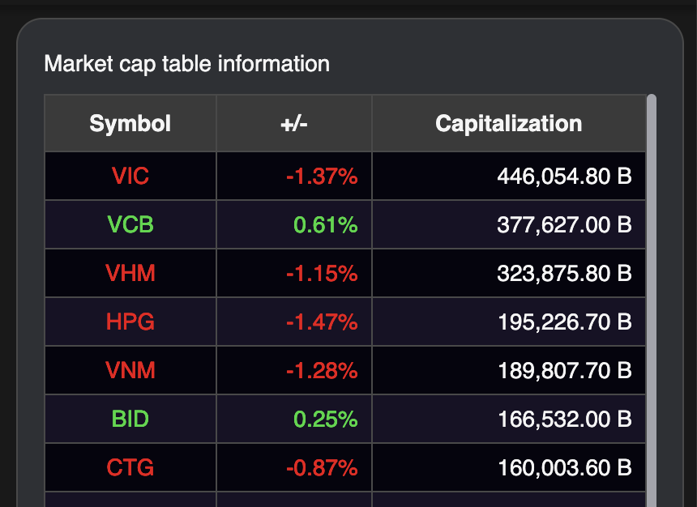

# Sumary
- Select Exchange
- Chart Market Cap
- Table Market Cap

> Pages includes: [Header](../../Common%20UI/Header.md), [Menu](../../Common%20UI/Menu.md), [Footer](../../Common%20UI/Footer.md) 

# Content

## Select Exchange
**Images:** 

**Feature:** 
- Select a exchange to change data chart and table
- Save state to context store for use in whole app

**Code:** 
- UI: ==[link code](src\components\basic-component\select-exchange\index.js)==
- Logic: 

## Chart Market Cap
**Images:**

**Feature:** 
- The map shows where investments are focused among small cap, mid, cap and large cap stocks
- Users can view details by hovering the mouse pointer over the content to be viewed.

**Code:** 
- UI: ==[link code](\src\views\MarketCap\ChartMarketCap\index.js)==
- Logic: 
	- SetInterval to convert data every 10 seconds.
	- SubScribe to server to get data of stock
	- call convertData TreeMap to update data to chart table
	- Render chart

## Market Cap Table

**Images: **

**Feature:** 
- User can view values in tabular form and can sort in ascending or descending order of values by column.

**Code:**
- UI:
- Logic:
	- Receive dataSource from parent component
	- Call listen method to listen data from server and set it to source data
	- Set configTable
	- Render configTable with data is source
