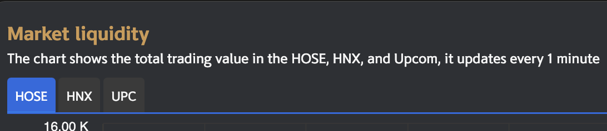
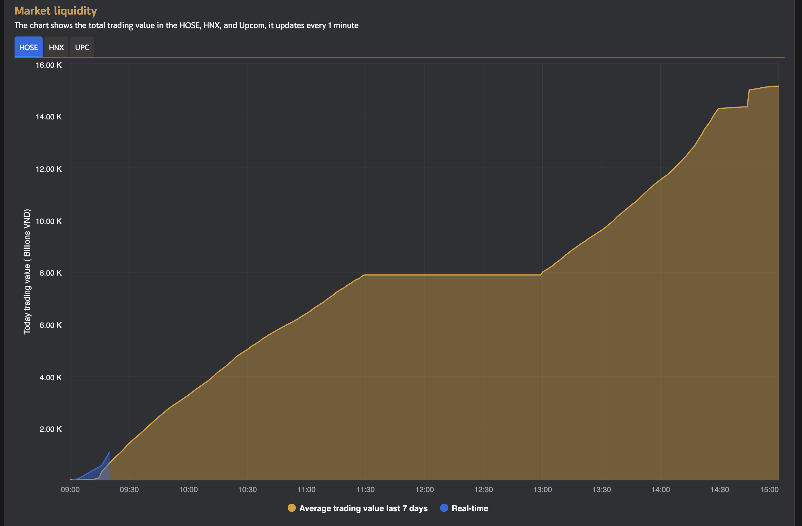
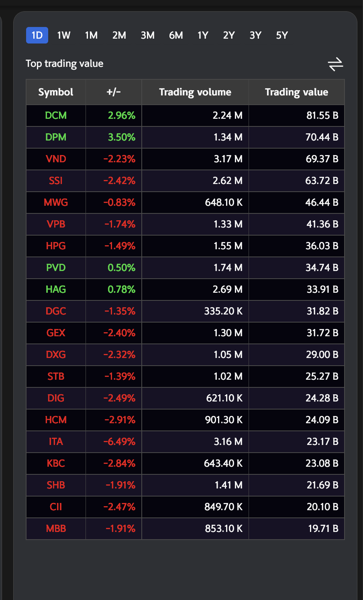

# Sumary
- Select Exchange
- Chart Liquidity
- Table Liquidity History
	- Select period time data
	- Top value
	- Top volume

> Pages includes: [Header](../../Common%20UI/Header.md), [Menu](../../Common%20UI/Menu.md), [Footer](../../Common%20UI/Footer.md) 

# Content

## Select Exchange
**Images:** 

**Feature:** 
- Select a exchange to change data chart and table
- Save state to context store for use in whole app

**Code:** 
- UI: 
- Logic: 

## Chart Liquidity
**Images:**

**Feature:** 
- The chart shows the total trading value in the HOSE, HNX, and Upcom, it updates every 1 minute.
- Users can view details by hovering the mouse pointer over the content to be viewed.

**Code:** 
- UI: 
- Logic: 
	 - Call getHist method to clear old hist data. 
	 - Call subscribe method to subscribe data to server.
	 - Call listen method to listen msg, process data.

## Market Liquidity Table

**Images: **

**Feature:** 
- User can view values in tabular form and can sort in ascending or descending order of values by column.
- View top by value and trading data
- Select exchange to views data

**Code:**
- UI:
- Logic:
	- Call filterOption from useContext
	- Get data
