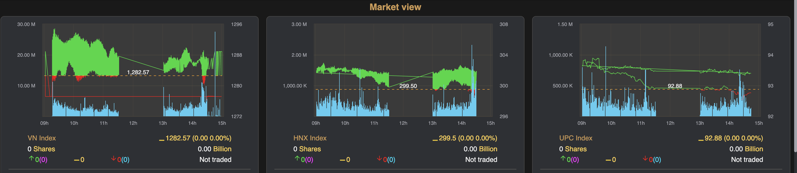
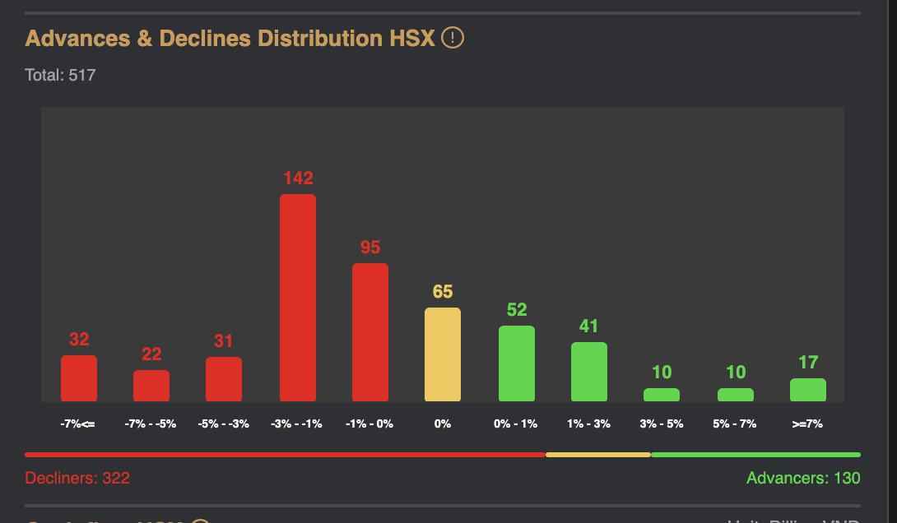
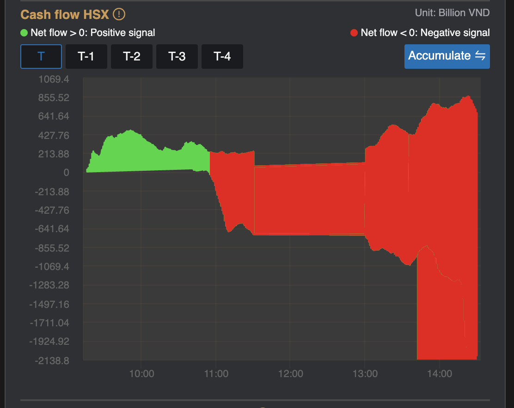
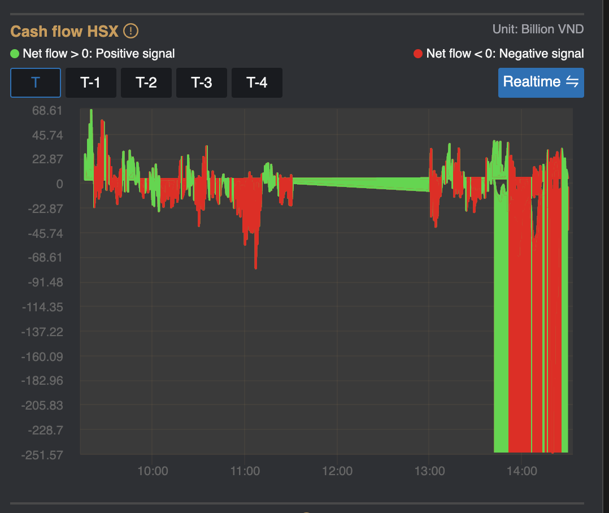
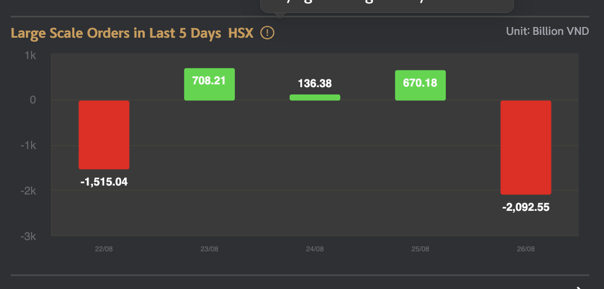
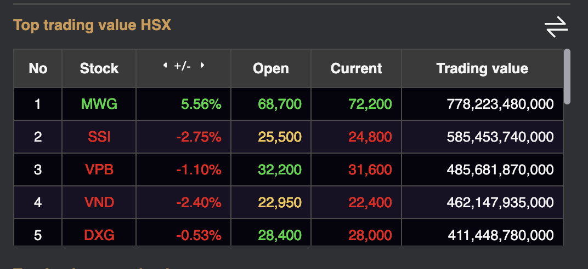

# Sumary

- Chart Index 
- Advances & Declines Distribution
- Cash flow
- Large Scale Orders in Last 5 Days
- Top Data
	- Top trading value
	- Top trading volume
	- Top foreigner net buying
	- Top increase price
	- Top decrease price

> Pages includes: [Header](../../Common%20UI/Header.md), [Menu](../../Common%20UI/Menu.md), [Footer](../../Common%20UI/Footer.md) 

# Content

## Chart Index 
**Images:** 

**Feature:** 
- View real-time data of 3 major market indices including: VN Index, HNX Index, UPC Index

**Code:** 
- UI: 
- Logic: 
	- listIndex was passed to HighChartInTraday as a prop
		- Listen realtime data
		- Re-set chart data evert 1 minute.
		- Format and render chart

## Advances & Declines Distribution
**Images:**

**Feature:** 
- The system will calculate based on the market's order matching information according to the frequency, it will be updated once every 1 minute.

**Code:** 
- UI: 
- Logic: 
	- code of chart was pass to Market_Deep as a props name code
	- Subcribe to listen RxJs event
		- If event listened have type equal to 'MKT_INC_DEC' and code equal to msgKey.
			- Process data to render
	- Render Chart
## Cash flow

**Images: **

 

**Feature:** 
- Is an indicator measured by the value of active buy orders - the value of active sell orders, to determine whether the cash flow is actively buying or selling actively.

**Code:**
- UI:
- Logic:
	- Code of chart and isIndex variables was passed from MarketView component to Cash_Flow_Chart component as a props with the same name.
	- Subcribe to listen RxJS event to get data
		- If type of msg is 'BUY_SELL_FLOW' and msgKey equal to code, and activeRef equal to 'T'.
			- If typeChartRef now references to value equal to 'rt', call handleDataRealtime function to get data
			- Else call handleDataAccumulate to get data
		- Call changeActive funtion to get data

## Large Scale Orders in Last 5 Days
**Images:**

**Feature:** 
- History by day data measured by the value of active buy orders - the value of active sell orders, to determine whether the cash flow is actively buying or selling actively..

**Code:** 
- UI: 
- Logic: 
	- Code of chart and isIndex was passed as props with the same name.
	- Set data to a null array
	- Create an InputParams contain 'NET_FLOW', '5', code value
	- sendRequest to get history cash flow with InputParams and two functions: getHistoryCashFlowResult, getHistoryCashFlowTimeout.
	- [getHistoryCashFlowResult](getHistoryCashFlowResult.md)

## Top Market Data
**Images:**

**Feature:** 
- Data sorted by criteria: price, volume, foreign transactions
- View as a table
- Top data includes
	- Top trading value
	- Top trading volume
	- Top foreigner net buying
	- Top increase price
	- Top decrease price

**Code:** 
- UI: 
- Logic: 
	- Code of exchange was passed to IndexOverviewGroup component as a prop with name currentExchange.
	- call listen method to listen message from server and get data for chart