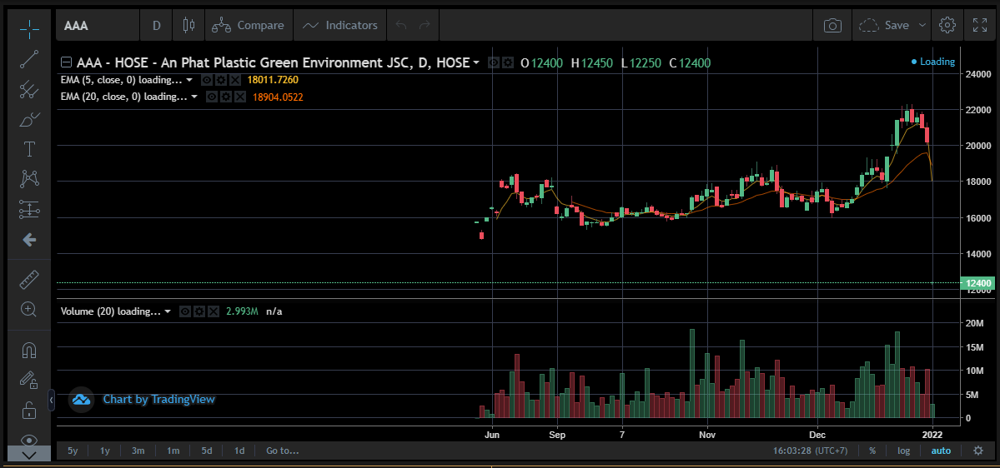
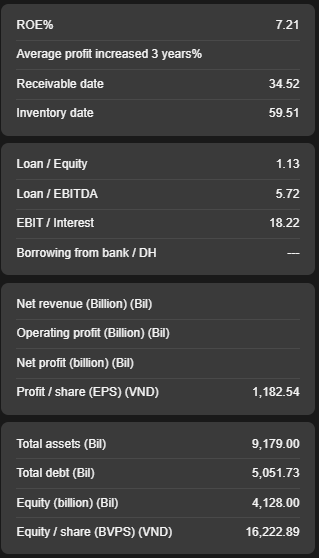
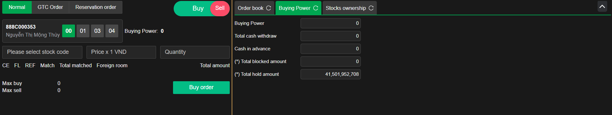

# Sumary
- Background run
- Trading View Chart
- Stock Extend
- Finance Indicator
- Normal Order table

> Pages includes: [Header](../../Common%20UI/Header.md), [Menu](../../Common%20UI/Menu.md), [Footer](../../Common%20UI/Footer.md) 
# Content
## Background run
- check if user are not login. Request user login or register
## Trading View Chart

**Images:**

**Feature:** 
- Show trading chart of one stock

**Code:**
- UI:
	- ==[TradingviewComponent](src\components\tradingview\index.tsx)
- Logic:
	- call subscribe method to listen RxJs event
		- use `setLevelSize` to set size of level
		- if type of messgae is `STOCK_INFO_DETAIL`, setShowTradingview is `false`
		-  if type of messgae is `HIDE_STOCK_INFO`, setShowTradingview is `true`
	- show chart base on `ShowTradingview` variable
## Stock Extend

**Images:**

**Feature:**
- Price-depth: show Price-depth, bids, offers of a stock
- Matched volume: show number of matched volume
- History price: show history price of stock that focusing on
- Cash flow: show cash flow of company that focusing on

**Code:**
- UI:
	- ==[Stock extend](src\views\NormalOrder\stock-extend.js)==
		- ==[Bid-ask](src\components\stock-info\bid-ask.js)==
		- ==[Price-deep](src\components\stock-info\price-depth.js)==
		- ==[History-price](src\components\stock-info\history-prices.js)==
		- ==[CashFlowChart](src\components\stock-info\cash-flow\index.js)==
		- ==[CashFlowHistory](src\components\stock-info\cash-flow-history\index.js)==
- Logic:
	- `stockCode`, `component`, `levelSize` was passed from parent component.
	-  If `stickCode` exist and `glb_sv.StockMarket[stockCode]` exist
		- Call getHist method to subscibe to server
		- Function `stockExtendEvent` call subscribe method to sen subscribe request to server
		- Set data to stateful variable
		- Call component to render table:
			- Bid-ask
			- Price-deep
			- History-price
			- CashFlowChart
			- CashFlowHistory
## Finance Indicator

**Images:**

**Feature:**
show Finance Indicator include 4 table:
- ROE
- Loan/Equity
- Net revenue
- Total assets

**code:**
- UI: ==[code link](src\components\stock-info\finance-indicator.js)
- Logic:
	- Call `queryFinanceInfo` to send request to server to get stock info. 
		- Call `handleQueryFinanceResult` function to handle and process result data. Data was save to `financeInfo` variable.
		- Render base on `financeInfo` variable.
[FinanceIndicator](FinanceIndicator.md)
## Normal Order

**Images**

**Feature:**
- User can create an order(sell or buy)

**code:**
- UI: 
- Logic: