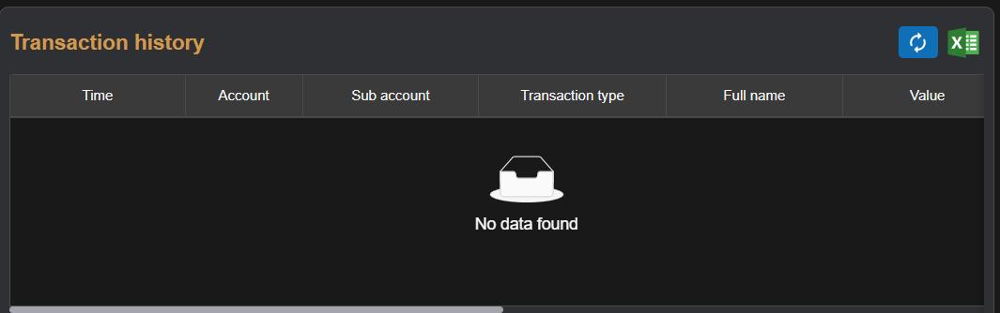

# Sumary
> Withdraw money to bank account (BIDV)
- Banking inform
- Transaction history
>  Pages includes: [Header](../../Common%20UI/Header.md), [Menu](../../Common%20UI/Menu.md), [Footer](../../Common%20UI/Footer.md) 
# Content
## Withdraw inform

**Images:**

**Features:**
- User can choose sub account to withdraw
- User can enter banking account to receive money
- User click submit button to confirm withdraw request
**Code:**

- UI:
- Logic:

## Transaction history

**Images:**

**Features:**
- Show withdraw transaction history of user
- User can export withdraw transation history to Execl file
**Code:**

- UI:
- Logic: