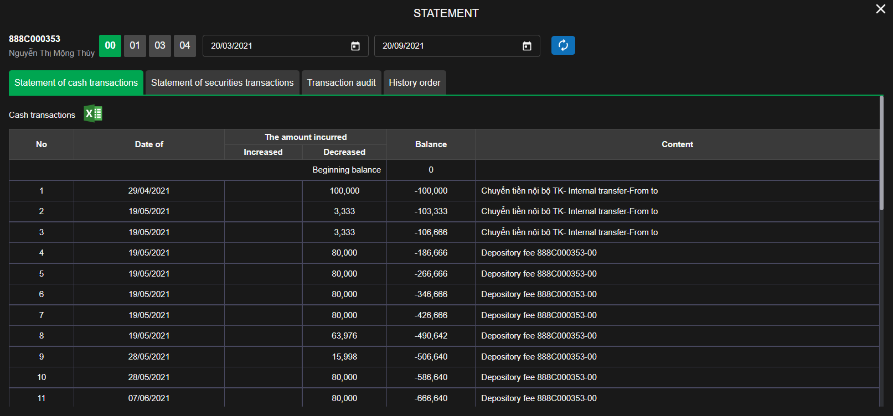

# Sumary
- History order
	- History order
	- Reservation order
	- Confirm your order
	- Statement
- Statement
	- Statement of cash transactions
	- Statement of securities transactions
	- Transaction audit
	- History order
> Pages includes: [Header](../../Common%20UI/Header.md), [Menu](../../Common%20UI/Menu.md), [Footer](../../Common%20UI/Footer.md) 

# Content
## History order
### History order
**Images:**

**Feature:**
- Show history order of user

**Code:**
- UI:
- Logic:

### Reservation order
**Images:**

**Feature:**
- Show reservation order of user

**Code:**
- UI:
- Logic:

### Confirm your order
**Images:**

**Feature:**
- Show oder confirmed of user

**Code:**
- UI:
- Logic:
### Statement
>Navigate to **[Statement](#Statement)**
## Statement
### Statement of cash transactions
**Images:**

**Feature:**
- Show history of cash transactions

**Code:**
- UI:
- Logic:

### Statement of securities transactions
**Images:**

**Feature:**
- Show history of securities transactions

**Code:**
- UI:
- Logic:

### Transaction audit
**Images:**

**Feature:**
- Show history of transaction audit

**Code:**
- UI:
- Logic:

### History order
> Navigate to **[History order](#History%20order)**