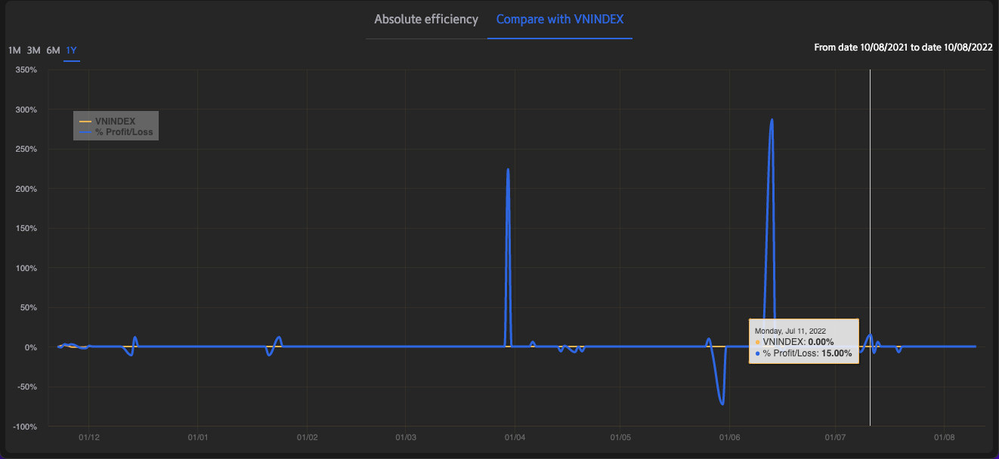

# Sumary
- History assets
- Statistic performance chart
- Portfolio performance chart
> Pages includes: [Header](../../Common%20UI/Header.md), [Menu](../../Common%20UI/Menu.md), [Footer](../../Common%20UI/Footer.md) 
# Content
## History assets
**Images:**

**Feature:**
- Show history assest of user in chart
- User can choose period of time to watch char
**Code:**
- UI:
- Logic

##  Statistic performance chart
**Images:**

**Feature:**
- Show sumary chart of profit anh loss
**Code:**
- UI:
- Logic

## Portfolio performance chart
**Images:**

**Feature:**
- Show absolute efficiency chart of user
- Show absolute efficiency compare with VNINDEX chart
**Code:**
- UI:
- Logic
