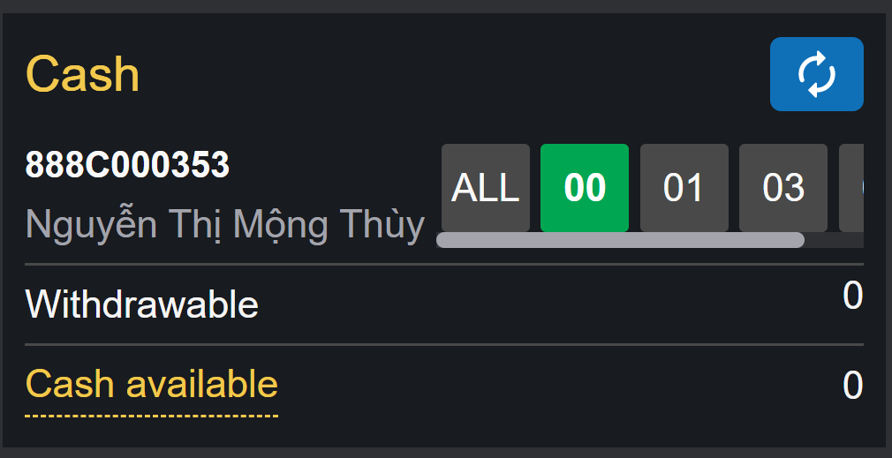
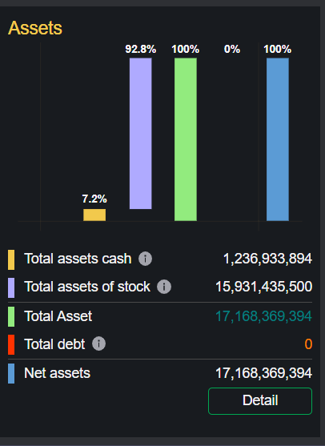
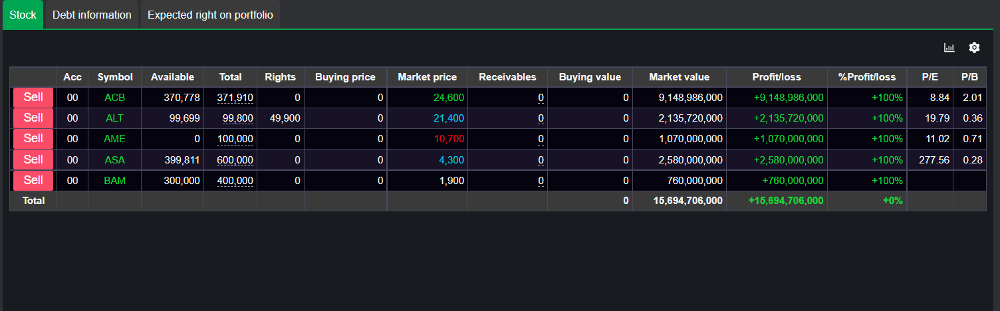

# Sumary
- Cash
- Assets
- Portfolio listing
	- Stock
	- Dept infomation
	- Expected right on portfolio
> Pages includes: [Header](../../Common%20UI/Header.md), [Menu](../../Common%20UI/Menu.md), [Footer](../../Common%20UI/Footer.md) 
# Content
## Cash

**Images:**

**Feature:**
- Show information of sub account of user
- User can choose sub account to view information
**Code:**
- UI:
- Logic
## Assets
**Images:**

Assets management

**Feature:**
- Show assets of user by sub account
- User can click to Detail button to check assets detail, an pop up will show up(Assest management)
	- User can choose sub account to see detail asset management
	- User can choose Investment portfolio to see investment portfolio information detail.
		- User can choose detail button to see that portfolio information detail
		- User can choose a period of time to filter result
		- User can choose Symbol to filter result
		- User can choose Query button to re-load filter
		- User can export result to Execl file
**Code:**
- UI:
- Logic
## Portfolio listing
### Stock
**Images:**

**Feature:**
- Show information of stocks user own
- User can click Sell button, a Quick Order popup will show up. detail in [order](../Normal%20Oder/normal-order.md)
- User can click chart button to view chart of all stock
- User can click setting button to filter result
**Code:**
- UI:
- Logic

### Dept infomation
**Images:**

**Feature:**
- Show dept infomation of user
**Code:**
- UI:
- Logic
### Expected right on portfolio
**Images:**

**Feature:**
- Show portfolio right user have
**Code:**
- UI:
- Logic
