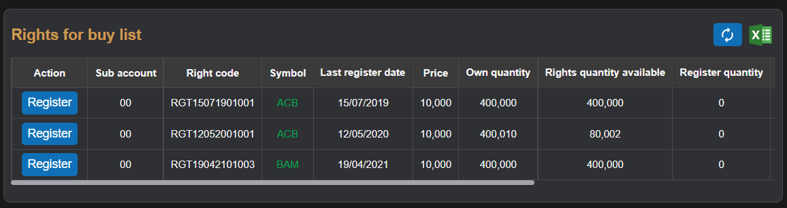

# Sumary
> Right to buy is voucher of user when buying stocks, was create by company own that stock
- Buy table
- List stock 
- Transation history
> Pages includes: [Header](../../Common%20UI/Header.md), [Menu](../../Common%20UI/Menu.md), [Footer](../../Common%20UI/Footer.md) 
# Content
## Buy table

**Images:**

**Feature:**
- User can buy stocks that user have right to buy

**Code**

- UI:
- Logic:
## List stock 

**Images:**

**Feature:**
- Show list of stock user have right to buy
- user can register stock to navigate to [Buy table](#Buy%20table)

**Code**
- UI:
- Logic:
## Transation history

**Images:**

**Feature:**
- Show transaction history of stock that user buy by right to buy section

**Code**
- UI:
- Logic:
