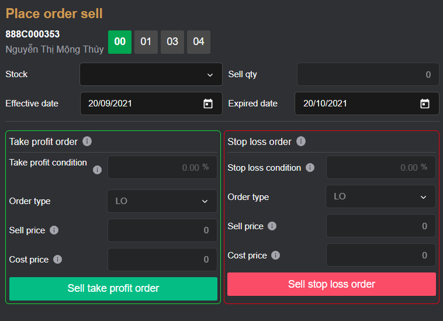
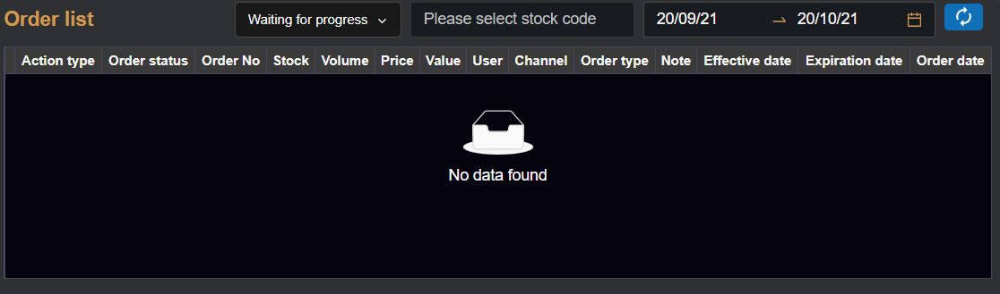

# Sumary
- Background run
- Take profit and stop loss order
- Stocks ownership
- Order list
> Pages includes: [Header](../../Common%20UI/Header.md), [Menu](../../Common%20UI/Menu.md), [Footer](../../Common%20UI/Footer.md) 
# Content
## Background run
- Check if user login or not, if user dont login, request user login
## Take profit and stop loss order(TP and SL)
**Images:**

**Features:**
- Users tells broker how much users are willing to make as a profit with one trade and close it once user are happy with the amount
**Code:**
- UI:
	- ==[TakeProfitStopLoss](src\views\TakeProfitStopLoss\index.js)==
	- ==[take-profit-stop-loss-form](src\views\TakeProfitStopLoss\take-profit-stop-loss-form.js)
- Logic:
	- Call function `TakeProfitStopLossForm` to handle create new TF and SL orders.
		- Handle user create new TF and SL orders event
		- After user create new order, multicast RxJs event with type `GET_DATA_TAKE_PROFIT_STOP_LOSS`
****
## Stocks ownership
**Images:**

**Features:**
- Show list of stock user have
**Code:**
- UI:
	- ==[Assets-buypower](src\views\QuickOrder\assets-buypower.js)==
- Logic:
	- Call `getAssetsStockList` function to get assets stock list of user
	- Set list of stocks of user into `stocklist` state variable
	- If RxJs receive event `GET_DATA_TAKE_PROFIT_STOP_LOSS`, re call function `getAssetsStockList` to reset data

## Order list
**Images:**

**Features:**
- Show list of TF and SL order user have
**Code:**
- UI: 
	- ==[code](src\views\TakeProfitStopLoss\index.js)
- logic: 
	- Call `getHistoryOrder` function to send request and get history orders of user.
	- Recall list of order when language change
	- Render list of stocks
